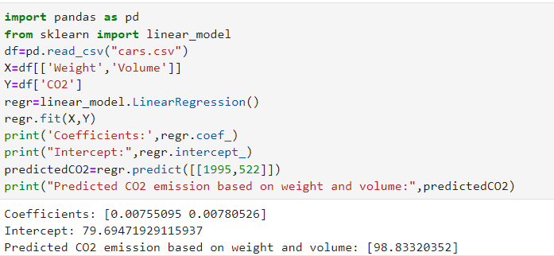

# Implementation of Multivariate Linear Regression
## Aim
To write a python program to implement multivariate linear regression and predict the output.
## Equipment’s required:
1.	Hardware – PCs
2.	Anaconda – Python 3.7 Installation / Moodle-Code Runner
## Algorithm:
### Step1
<br>
Import Pandas library.

### Step2
<br>
Import Linear_model from sklearn.

### Step3
<br>
Read the csv file using pandas library.

### Step4
<br>
Enter the parameters of the linear function.

### Step5
<br>
Print the parameters of the linear function.

## Program:
```
import pandas as pd
from sklearn import linear_model
df=pd.read_csv("cars.csv")
X=df[['Weight','Volume']]
Y=df['CO2']
regr=linear_model.LinearRegression()
regr.fit(X,Y)
print('Coefficients:',regr.coef_)
print("Intercept:",regr.intercept_)
predictedCO2=regr.predict([[1995,522]])
print("Predicted CO2 emission based on weight and volume:",predictedCO2)

```
## Output:


<br>

## Result
Thus the multivariate linear regression is implemented and predicted the output using python program.